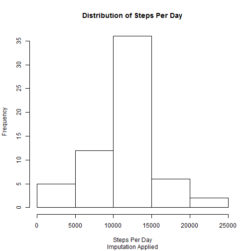

# Reproducible Research: Peer Assessment 1


## Loading and preprocessing the data


```r
library(lattice)
library(RCurl)
```

```
## Loading required package: bitops
```

```r
x <- getURL("https://github.com/br949805/RepData_PeerAssessment1/raw/master/activity.csv", 
    ssl.verifypeer = 0L, followlocation = 1L)

data <- read.csv(text = x)
rm(x)
```


## What is mean total number of steps taken per day?

```r
agg <- aggregate(steps ~ date, data = data, FUN = sum, na.rm = T)

hist(agg$steps, main = "Distribution of Steps Per Day", xlab = "Steps Per Day")
```

 


The mean steps per day is 10766 and the median is 10765.

## What is the average daily activity pattern?

```r
agg_interval <- aggregate(steps ~ interval, data = data, FUN = mean, na.rm = T)
plot(x = agg_interval$interval, y = agg_interval$steps, type = "l", main = "Average Number of Steps Per Interval", 
    xlab = "Interval", ylab = "Average Number of Steps", col = "blue")
```

 


The 5-minute interval with the maximum number of average steps is interval number 835.


## Imputing missing values

There are 2304 missing values in the data.

I used the mean of the interval across all days of the dataset to impute the missing values.


```r
dataNoNa <- data

for (i in 1:length(dataNoNa$steps)) {
    
    if (is.na(dataNoNa$steps[i])) {
        dataNoNa$steps[i] <- agg_interval$steps[dataNoNa$interval[i] == agg_interval$interval]
    }
}

agg_NoNa <- aggregate(steps ~ date, data = dataNoNa, FUN = sum, na.rm = T)

hist(agg_NoNa$steps, main = "Distribution of Steps Per Day", sub = "Imputation Applied", 
    xlab = "Steps Per Day")
```

 


The mean steps per day is 10766 and the median is 10766.

Therefore, the effect of imputation is not significant and these mean and median values are not significantly different from those found using the original dataset without imputation.The addition of these imputed values should serve to correct for the missing data when estimating the total daily number of steps. Resulting in a higher but potentially more accurate estimation.

## Are there differences in activity patterns between weekdays and weekends?


```r
dataNoNa$weekday <- sapply(as.Date(dataNoNa$date), weekdays)
dataNoNa$weekday <- as.factor(dataNoNa$weekday)

wkEndDays <- c("Sunday", "Saturday")

dataNoNa$wkEnd <- ifelse(dataNoNa$weekday %in% wkEndDays, "Weekend", "Weekday")
dataNoNa$wkEnd <- as.factor(dataNoNa$wkEnd)

agg_wkdays <- aggregate(steps ~ interval, data = subset(dataNoNa, wkEnd == "Weekday"), 
    FUN = mean, na.rm = T)
agg_wkdays$wkEnd <- "Weekday"
agg_wkEnd <- aggregate(steps ~ interval, data = subset(dataNoNa, wkEnd == "Weekend"), 
    FUN = mean, na.rm = T)
agg_wkEnd$wkEnd <- "Weekend"

agg_tot <- rbind(agg_wkdays, agg_wkEnd)
agg_tot$wkEnd <- as.factor(agg_tot$wkEnd)

xyplot(agg_tot$steps ~ agg_tot$interval | wkEnd, data = agg_tot, type = "l", 
    layout = c(1, 2), main = "Weekend vs Weekday: Number of Steps", xlab = "Interval", 
    ylab = "Number of Steps")
```

 


